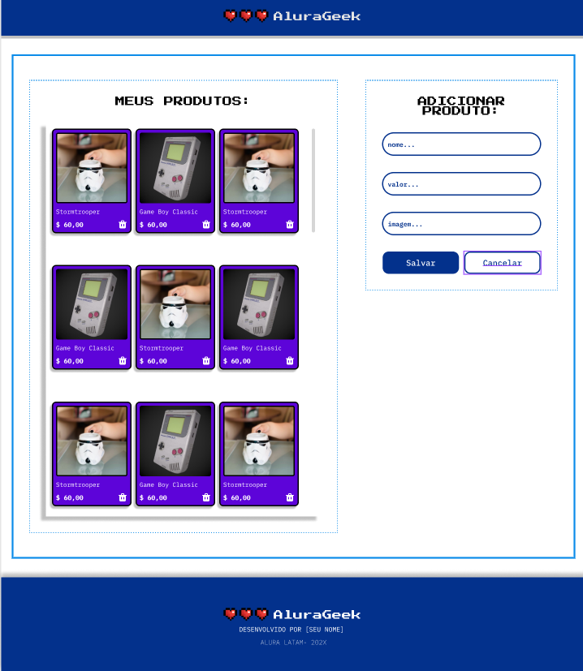

<h1 align="center"> Challenge da formação JavaScript do projeto ONE | T6   Alura Latam + Oracle </h1>

<h2 align="center">⭐⭐</h2>

Faça sua própria loja online Geek! Você só precisa adicionar e remover produtos. 
(Obs: Projeto feito com Json Server, portanto o link deployado não será editável, somente o localhost)

## Link do projeto

https://challenge-alura-geek-beige.vercel.app/

